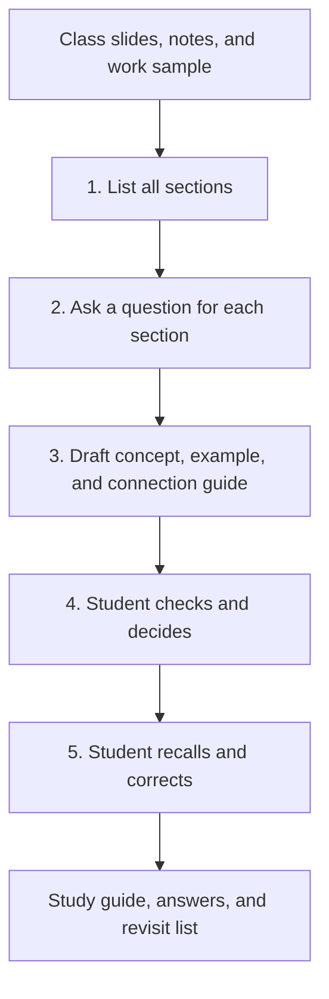

# Workflow Diagram — Input to Output

The fourth step is a human check. If the student finds a gap or an unsupported claim, the draft is corrected before recall questions continue. The question for every section was added after peer feedback so that the workflow can find weaknesses the student had not named in advance.
